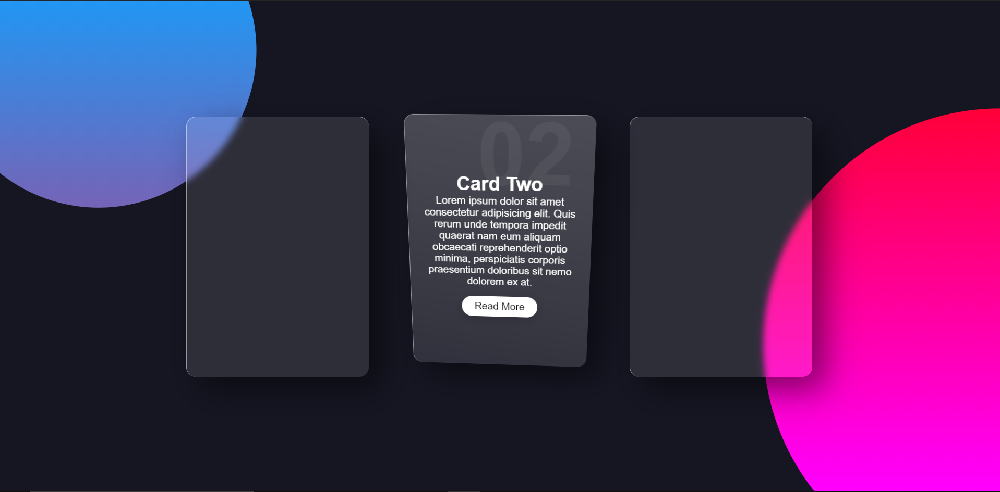

<!-- Top Image and Title -->

	
	<h1>Card Animation</h1>
	<!-- Subtitle/Description -->
	<h4>O card possui uma animação ao passar o mouse em cima(hover), foi desenvolvido utizando CSS e vanilla tilt</h4>

<!-- Nav Menu -->

    <a  href=#telescope-tecnologias>Technologies</a>  

### :telescope: Technologies

- [HTML5](https://developer.mozilla.org/pt-BR/docs/Web/HTML)

- [CSS3](https://developer.mozilla.org/pt-BR/docs/Web/CSS)

- [VANILLA-TILT](https://micku7zu.github.io/vanilla-tilt.js/)
